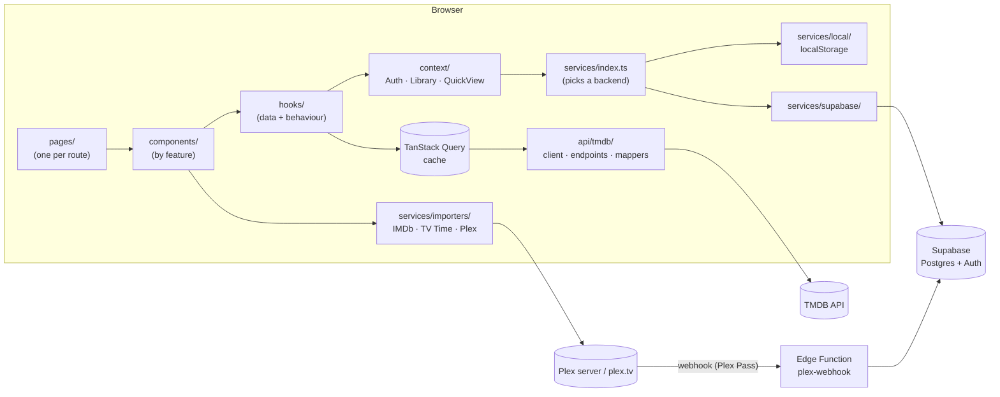

# Reeltrack

**One place to track every movie and TV show you watch.** Discover what to watch next, tick off episodes, and see your viewing stats. It replaces juggling TV Time, IMDb and Plex.

Built with **React 19, TypeScript and Vite**. Movie and TV data comes from [TMDB](https://www.themoviedb.org). Accounts can be browser-only, or synced to the cloud with [Supabase](https://supabase.com). Inspired by [Fergtato/vortex](https://github.com/Fergtato/vortex) (Vue 2), rebuilt from scratch to be faster and easier to work on.

---

## Contents

- [Features](#features)
- [Quick start](#quick-start)
- [Tech stack](#tech-stack)
- [Architecture](#architecture)
- [Folder structure](#folder-structure)
- [Key components](#key-components)
- [Data model](#data-model)
- [Performance](#performance)
- [Scripts](#scripts)
- [Limitations & ideas](#limitations--ideas)

---

## Features

| Area | What you get |
| --- | --- |
| **Home** | A trending hero banner, then **Recommended for You** (based on your library), then rows for Most Watched, Recently Released, New Episodes, Top Rated and Coming Soon. |
| **Navigation** | A sidebar (Home, Search, Movies, TV Shows, Profile, Import & Sync) and a top bar with instant search and your profile picture or a log-in button. |
| **Search** | Instant results while you type in the top bar, plus a full search page with type, genre, year, rating and sort filters. Filters are kept in the URL, so searches can be shared and bookmarked. |
| **Movies / TV Shows** | Category tabs (Popular, Trending, Top Rated, Upcoming…) and genre chips, with infinite scrolling. |
| **Quick View** | Press **+** on any poster for a pop-up preview with Watchlist, Watched and Add to list buttons, without leaving the page. |
| **Detail pages** | Watchlist, Watching or Completed status, plus the cast, the trailer, an IMDb link and "More like this". **Movies:** log watches, including rewatches. **TV:** tick off episodes one at a time or a season at a time, use **Mark all as watched**, and log rewatches of a whole show, a season or a single episode. |
| **Profile** | **Upcoming Episodes** for the shows you track, then **separate TV and movie stats**: hours watched and counts for this week, the last 6 months, the last year and lifetime, plus a 12-month chart, top genres and recent activity. Below that are your custom lists, then paginated **Movies** and **TV Shows** shelves (Watchlist, Watching, Completed). |
| **Smart status** | A show moves to **Completed** automatically once it has finished airing and you've watched every episode. Running shows stay on **Watching**. |
| **Import & Sync** | Backup and restore. Import from **IMDb** (ratings and watchlist CSVs) and **TV Time** (data export). **Plex:** a one-off history import via "Sign in with Plex" (this also works on servers shared with you), plus automatic logging with Plex Pass. |
| **Accounts** | Browser-only by default. Add two Supabase keys for real email accounts and cross-device sync. |

---

## Quick start

```bash
npm install
cp .env.example .env     # then fill it in (see below)
npm run dev              # → http://localhost:5174
```

**`.env`**

| Variable | Required | Where to get it |
| --- | --- | --- |
| `VITE_TMDB_TOKEN` | ✅ | Free TMDB account → **Settings → API** → *API Read Access Token* (a v3 API key also works) |
| `VITE_SUPABASE_URL` | Optional | Supabase project → **Connect** |
| `VITE_SUPABASE_KEY` | Optional | The **publishable** (or legacy *anon*) key. Never use the secret/service key. |

Without the Supabase variables, everything is saved in your browser. To turn on cloud accounts, sync and Plex auto-sync, follow **[SUPABASE_SETUP.md](SUPABASE_SETUP.md)**. It takes about 10 minutes.

---

## Tech stack

| Concern | Choice | Why |
| --- | --- | --- |
| UI | **React 19** and **TypeScript** (strict) | Type-safe components, from the API layer up to the UI |
| Build and dev server | **Vite** | Instant hot reload, and per-page code splitting |
| Routing | **React Router** | Lazy-loaded routes, scroll restoration, and URL-driven filters |
| Server data | **TanStack Query** | Caching, de-duplicated requests, infinite scroll and parallel queries |
| Styling | **CSS Modules** plus design tokens in `styles/globals.css` | Styles are scoped to each component, with no CSS-in-JS runtime |
| Icons | **lucide-react** | Tree-shaken SVG icons |
| Backend (optional) | **Supabase**: Postgres, Auth, Edge Functions | Real accounts, row-level security, and the Plex webhook endpoint |
| Movie / TV data | **TMDB API** | A free, comprehensive catalogue |

No UI kit or chart library is used. The charts are plain HTML and CSS.

---

## Architecture



**The main rules the code follows:**

1. **Components never see raw API data.** `api/tmdb/mappers.ts` converts TMDB responses into the clean types in `types/`.
2. **Business rules are plain functions.** Tracking logic lives in `utils/library.ts`, stats maths in `utils/stats.ts`, and TV progress in `utils/tvProgress.ts`. None of them touch React, so they're easy to read and test.
3. **The backend can be swapped.** Contexts depend on the `AuthService` and `LibraryRepository` interfaces in `services/types.ts`, and `services/index.ts` picks either the browser or Supabase implementation.
4. **All URLs come from one place:** `constants/routes.ts`.

---

## Folder structure

```
reeltrack/
├── supabase/
│   ├── schema.sql                 Tables, row-level security, sign-up trigger, helper functions
│   └── functions/plex-webhook/    Edge Function that receives Plex "finished watching" events
├── SUPABASE_SETUP.md              Step-by-step cloud setup
└── src/
    ├── api/tmdb/                  TMDB client, endpoint functions, raw types, mappers, image URLs
    ├── app/                       App providers, router (lazy pages), React Query client
    ├── components/
    │   ├── layout/                AppLayout, Sidebar, TopBar, UserMenu, ProtectedRoute, banners
    │   ├── media/                 MediaCard, MediaRow, MediaGrid, PaginatedMediaGrid, ListRow
    │   ├── details/               DetailHero, TrackActions, ShowWatchActions, SeasonList/SeasonItem, CastList, AddToListMenu
    │   ├── quickView/             QuickViewModal
    │   ├── home/                  HeroBanner, RecommendedRow
    │   ├── browse/                BrowseView (shared by the Movies and TV Shows pages)
    │   ├── search/                SearchBar (top bar), SearchInput, SearchFilters
    │   ├── profile/               ProfileHeader, UpcomingEpisodes, CustomLists, LibraryShelves
    │   ├── stats/                 StatsPanel, StatCard, MonthlyChart, GenreBreakdown, RecentActivity
    │   ├── settings/              Import & Sync sections: CloudSync, Backup, FileImport, Plex
    │   └── ui/                    Building blocks: Button, Modal, Tabs, Pagination, Avatar, Spinner…
    ├── constants/                 Routes, genres, home-page lists, status labels, defaults
    ├── context/                   AuthContext, LibraryContext, QuickViewContext
    ├── hooks/                     useMediaQueries, useRecommendations, useUpcomingEpisodes, useAutoCompleteShows…
    ├── pages/                     One file per route, mostly composing components
    ├── services/
    │   ├── index.ts               Picks the backend: Supabase if configured, otherwise browser-only
    │   ├── types.ts               The AuthService and LibraryRepository contracts
    │   ├── local/                 Browser-only accounts and data (localStorage)
    │   ├── supabase/              Supabase auth, table storage, Plex webhook settings
    │   ├── importers/             IMDb, TV Time and Plex importers, plus TMDB matching
    │   ├── backup.ts              Backup file export and restore
    │   └── searchService.ts       Chooses between TMDB search and discover
    ├── styles/globals.css         Design tokens (colours, spacing, fonts) and base styles
    ├── types/                     Shared types: media, user, search, import
    └── utils/                     Pure helpers: library rules, stats, TV progress, diff, CSV, dates
```

---

## Key components

### 1. TMDB data layer — `src/api/tmdb/`

- **`client.ts`** wraps `fetch`. It accepts either a v4 Bearer token or a v3 API key, and turns HTTP failures into a `TmdbError`.
- **`endpoints.ts`** has one function per endpoint, e.g. `getMediaDetails` (with credits, videos and recommendations in a single request), `discover`, `searchMulti`, `getSeasonEpisodes`, and `findByExternalId` (look up a title by IMDb or TVDB id).
- **`mappers.ts`** converts snake_case TMDB JSON into `MediaSummary`, `MediaDetails` and `Episode`. That includes TV-only fields like `lastAiredEpisode` and `nextEpisode`.
- **`hooks/useMediaQueries.ts`** exposes these as React Query hooks. The cache is fresh for 10 minutes, it doesn't retry on 401/404, and `useInfiniteMedia` handles infinite scrolling.

### 2. Backends and accounts — `src/services/`

```ts
interface AuthService      { subscribe, login, register, logout, updateProfile }
interface LibraryRepository { load(userId), save(userId, previous, next) }
```

- **`local/`**: accounts with a salted SHA-256 password hash, and one JSON blob per user in `localStorage`. This is fine for personal use on one machine, but it is **not** real security.
- **`supabase/`**: email and password through Supabase Auth, with data stored in normalised tables. `save()` doesn't re-upload everything. It calls **`utils/diff.ts`**, which compares the old and new data by object reference (unchanged items keep the same object), and sends only the rows that were inserted, updated or deleted.
- **`services/index.ts`** picks the backend from the environment variables. The Supabase library is **lazy-loaded**, so browser-only mode never downloads it.

### 3. Library state — `src/context/LibraryContext.tsx`

This holds the user's `UserData` (library, watch history and lists) and exposes actions like `setStatus`, `logMovieWatch`, `markEpisodesWatched`, `logEpisodeRewatch` and `importItems`.

- **Optimistic:** the UI updates instantly, and the save runs in the background.
- **Ordered:** saves run one after another through a promise queue, so Supabase receives changes in the order they happened.
- **Self-healing:** if a save fails, a banner appears (`SyncErrorBanner`) and the app reloads your saved data.
- **Fresh:** in cloud mode, data is reloaded when you come back to the tab, which picks up changes from other devices and from Plex.
- It keeps an **episode index** (`show:season → episode → times watched`) so every episode checkbox can be looked up instantly.

### 4. Tracking rules — `src/utils/library.ts`

These are pure functions with signatures like `(data, …) => newData`. They never mutate the data.

- Logging a movie marks it **Completed**. Logging it again counts as a rewatch, and **Undo** removes the latest one.
- Watching an episode moves a show to **Watching**. Unticking an episode of a Completed show moves it back to Watching.
- `mergeImport` and `mergeUserData` merge imports and backups **without creating duplicates**, and never move a status backwards.
- Everything stored is stripped down to a lightweight `MediaSummary` (`toSummary`).

### 5. Stats — `src/utils/stats.ts` and `components/stats/`

Every movie viewing and every episode is a **`WatchEvent`** with a runtime and a date. All stats are worked out from these events, so they always agree with each other:

- `computePeriodStats` gives hours, viewings and number of titles for **this week** (from Monday), **6 months**, **1 year** and **lifetime**.
- `monthlyBreakdown` produces the 12-month bar chart, and `topGenres` the genre breakdown.
- TV and movies are calculated separately (`StatsPanel` has a tab for each).

### 6. TV progress — `src/utils/tvProgress.ts`

TMDB's season list and its `lastAiredEpisode` tell the app how many episodes have aired, without downloading every season. From that, `getShowProgress` works out:

- watched vs aired episodes, which drives the progress bar and "Mark all as watched"
- **full watches**: the fewest times any aired episode has been watched, which drives "Watched 2× · Log rewatch"

`isShowCompleted` combines this with whether the show has ended (status *Ended* or *Canceled*). **`hooks/useAutoCompleteShows.ts`** applies it in the background, whichever way the episodes were logged.

### 7. Recommendations and upcoming episodes

- **`hooks/useRecommendations.ts`**: takes your 6 most recently updated titles and fetches TMDB recommendations for each in parallel (`useQueries`). Titles that appear for several of them score higher, and anything you already track is hidden.
- **`hooks/useUpcomingEpisodes.ts`**: reads `nextEpisode` for every TV show you track (cached for 6 hours), sorted by air date. The cards show "Today", "Tomorrow" or the weekday, and a Season premiere or Finale badge.

### 8. Quick View — `context/QuickViewContext.tsx` and `components/ui/Modal.tsx`

There is **one** modal for the whole app, rather than one per card. `MediaCard` calls `openQuickView(media)`. The modal is the native `<dialog>` element opened with `showModal()`, so focus trapping, Esc to close and layering above the page come from the browser. `closedby="any"` closes it when you click outside, with a fallback for Safari. It also closes when you navigate to another page.

### 9. Importers — `src/services/importers/`

| File | Source | How titles are matched |
| --- | --- | --- |
| `imdb.ts` | Ratings and watchlist CSV exports | IMDb id via TMDB `/find`. A rated movie becomes a viewing on the date you rated it. |
| `tvtime.ts` | TV Time data export CSVs | Flexible column detection, TVDB id via `/find`, falling back to a name search |
| `plex.ts` | Your Plex server | **Owners:** the full history log, with every viewing and its date. **Shared users:** your own watched marks from each library. |
| `plexAuth.ts` | plex.tv | **"Sign in with Plex"** using Plex's PIN login, then automatic server discovery, connecting to the first address that responds |

Shared building blocks:

- **`resolver.ts`** caches every TMDB lookup, so 500 episodes of one show cost a single show lookup.
- **`collector.ts`** groups rows into one item per title.
- **`hooks/useImportFlow.ts`** runs the shared steps: matching with progress, a preview, then confirm. Nothing is saved until you press Import, and running an import again never creates duplicates.

### 10. Plex auto-sync — `supabase/functions/plex-webhook/`

This is a Deno Edge Function. With Plex Pass, Plex POSTs a `media.scrobble` event to a URL containing a secret token for your account. The function:

1. identifies you from the token
2. optionally ignores other users on the server
3. matches the title using Plex's tmdb, imdb or tvdb ids (falling back to a search)
4. skips duplicates
5. inserts a `watch_events` row and updates your library status

Setup is in [SUPABASE_SETUP.md](SUPABASE_SETUP.md#6-plex-auto-sync-optional-needs-plex-pass-about-5-min).

### 11. UI building blocks — `src/components/ui/`

`Button`, `Tabs`, `Modal`, `Pagination`, `Avatar`, `Spinner`, `EmptyState`, `ErrorMessage` and `LoadMoreTrigger` (an IntersectionObserver used for infinite scroll).

**`PaginatedMediaGrid`** measures the grid's actual column count (`useGridColumns`), so each page is always exactly N full rows at any screen width.

---

## Data model

The app types (`types/user.ts`) match the Supabase tables in `supabase/schema.sql`:

| Table | Purpose | Key |
| --- | --- | --- |
| `profiles` | Username, display name, avatar, Plex webhook token | `id` = auth user id |
| `library_entries` | Tracked titles and their status: watchlist, watching or completed | `(user_id, media_type, tmdb_id)` |
| `watch_events` | Every movie viewing and every episode. **All stats come from here.** | `id` |
| `custom_lists` | User-made lists, with their items stored as JSON | `id` |

Every table has **row-level security**, so users can only read and write their own rows. A trigger creates a profile on sign-up, and `username_available()` lets the sign-up form check a username without exposing anyone's profile.

---

## Performance

- **Code splitting:** every page is lazy-loaded, and the Supabase SDK is only downloaded when it's configured.
- **Caching:** TMDB responses are cached by React Query, so going back to a page is instant.
- **Lazy rows:** each home-page row only fetches when it scrolls near the screen (`useInView`). Off-screen rows also use `content-visibility: auto`.
- **Right-sized images:** each image uses the smallest TMDB size that looks sharp, and images load lazily. The hero image has `fetchpriority="high"`.
- **Less work while typing:** search input is debounced, and filters live in the URL rather than in global state.
- **Smaller uploads:** cloud saves send only what changed.
- **Fast first requests:** connections to TMDB are opened early with `preconnect`.

---

## Scripts

| Command | What it does |
| --- | --- |
| `npm run dev` | Start the dev server (port 5174) with hot reload |
| `npm run build` | Type-check, then build a production bundle into `dist/` |
| `npm run preview` | Serve the production build locally |
| `npm run typecheck` | Run TypeScript only |

---

## Limitations & ideas

- **Browser-only accounts** live in `localStorage`. Use Supabase for real accounts and sync.
- **"Top Rated" uses TMDB ratings.** IMDb has no public API.
- **TV Time's export format isn't documented.** The importer recognises the commonly used column names.
- **Plex for shared users:** Plex only keeps the most recent watch date per title, so rewatches don't come across.
- **Ideas:**
  - a "Continue watching / Up next" row on the home page
  - unit tests for `utils/` (the business rules are already pure functions)
  - a Trakt integration
  - push notifications for new episodes
  - hosting on Vercel, for phone access

---

Movie and TV data and images are provided by [TMDB](https://www.themoviedb.org). This product uses the TMDB API but is not endorsed or certified by TMDB.
